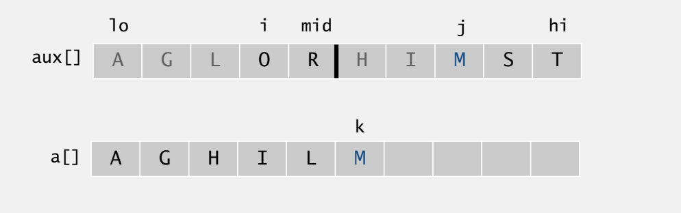

# interview study sheet
A quick study sheet I use as a refresher :smile:

- [Data Structures](#data-structures)
- [Algorithms](#algorithms)
- [Other Concepts](#other-concepts)
- [Math](#math)
- [Common Problems](#common-problems)
- [Just Python Things](#just-python-things)
- [Java Cheatsheet](#java-cheatsheet)
- [Programming Languages](#programming-languages)
- [Problem-solving Strategies](#problem-solving-strategies)

Also, there's much more to computer science than these simple topics! There are a multitude of online resources for broadening and deepening your core CS knowledge; https://teachyourselfcs.com/ is one such site.

## Data Structures
### Array
* Time complexity:
  * Access by index: `O(1)`
  * Search by value: `O(n)`
  * Insert: `O(n)` (need to shift values)
  * Delete: `O(n)` (need to shift values)
  * Append: `O(1)`
* Python stuff:
  * List: `a = [1,2,3]`, mutable
  * Tuple: `a = (1,2,3)`, immutable, slightly faster than list
  * Dict: `a = {'one': 1, 'two': 2, 'three': 3}`. access by `a['one']`, can't use number of access because dicts are unordered
  * For loop:
  ```python
  for index, item in enumerate(items, start=0):   # default is zero
    print(index, item)
  ```

### Linked List
* Time complexity:
  * Access by index: `O(n)`
  * Search by value: `O(n)`
  * Assuming you have a pointer to the node right before the one you want to insert or delete
    * Insert: `O(1)`
    * Delete: `O(1)`
* "Runner" Technique: iterate through the linked list with two pointers simultaneously, with one ahead of the other
* Singly-linked list:
```python
class Node(object):
    def __init__(self, data, next):
        self.data = data
        self.next = next
        
class SingleList(object):
    head = None
    tail = None
 
    def append(self, data):
        node = Node(data, None)
        if self.head is None:
            self.head = self.tail = node
        else:
            self.tail.next = node
        self.tail = node
 
    def remove(self, node_value):
        current_node = self.head
        previous_node = None
        while current_node is not None:
            if current_node.data == node_value:
                # if this is the first node (head)
                if previous_node is not None:
                    previous_node.next = current_node.next
                else:
                    self.head = current_node.next
 
            # needed for the next iteration
            previous_node = current_node
            current_node = current_node.next
```
* Doubly-linked list:
```python
class Node(object):
    def __init__(self, data, prev, next):
        self.data = data
        self.prev = prev
        self.next = next
        
class DoubleList(object):
    head = None
    tail = None
 
    def append(self, data):
        new_node = Node(data, None, None)
        if self.head is None:
            self.head = self.tail = new_node
        else:
            new_node.prev = self.tail
            new_node.next = None
            self.tail.next = new_node
            self.tail = new_node
 
    def remove(self, node_value):
        current_node = self.head
        while current_node is not None:
            if current_node.data == node_value:
                # if it's not the first element
                if current_node.prev is not None:
                    current_node.prev.next = current_node.next
                    current_node.next.prev = current_node.prev
                else:
                    # otherwise we have no prev (it's None), head is the next one, and prev becomes None
                    self.head = current_node.next
                    current_node.next.prev = None
            current_node = current_node.next
```

### Stacks & Queues
* **Stack**: last in, first out (LIFO)
  * Adding an element and popping the most recently added element are `O(1)` operations
  ```python
  class Stack:
     def __init__(self):
         self.items = []

     def isEmpty(self):
         return self.items == []

     def push(self, item):
         self.items.append(item)

     def pop(self):
         return self.items.pop()

     def peek(self):
         return self.items[len(self.items)-1]

     def size(self):
         return len(self.items)
  ```
* **Queue**: first in, first out (FIFO)
  * Adding an element and popping the oldest element are `O(1)` operations
  ```python
  class Queue:
    def __init__(self):
        self.items = []

    def isEmpty(self):
        return self.items == []

    def enqueue(self, item):
        self.items.insert(0,item)

    def dequeue(self):
        return self.items.pop()

    def size(self):
        return len(self.items)
  ```
* **Double-ended queue**: stack + queue combined
* `push` adds elements & `pop` extracts elements

### Hashing
* A *hash function* is a function mapping an object to an integer such that if `a==b`, `H(a)==H(b)`
* Universal hashing: a randomized way of drawing a hash function from some set of functions so that performance is good in expectation
* Perfect hashing: has no collisions; usually only practical when the set of keys is roughly constant

#### Hash Tables
* A *hash table* is an array whose indices correspond to results from a hash function (implemented as a dictionary in Python)
* Provides `O(1)` lookup, assuming load factor is small enough
* **Load factor**: `n/k`, where `n` is number of entries and `k` is number of buckets
* **Collision resolution**
  * Separate Chaining (e.g. with linked lists)
  * Open addressing (e.g. with linear probing, quadratic probing, or double hashing)
   * When collision happens, use various methods to find the next empty cells
   * Search: start at the place given by hash function and move forward until matching key is found. If reaching an empty cell, that means key is not in hash table.
   * Deletion: When empty cell i, need to search forward until finding either another empty cell or a key (z) that can be moved to cell i (that is, a key whose hash value is equal to or earlier than i). Then when z is empty, continue to do the same until it terminates by reaching a cell that was already empty.
* **Table doubling**: choose a new hash function to map to the new size and insert elements from old table into new table
* **Simple uniform hashing assumption (SUHA)**: a hash function maps to any slot with equal probability

### Trees
* A *tree* is an undirected, connected, acyclic graph
  * Has `v` vertices and `v-1` edges
  * Degree: the number of edges incident to the vertex
  * A **leaf** is a vertex of degree 1 (child, not parent)
  * One node is designated as the **root**
  * A node's **depth** is the length of its path to the root
  * A node's **height** is the longest path to the furthest leaf
  * Internal node: any node that has a child node 
* A **forest** has multiple distinct trees (a disjoint union)
* An **n-ary tree** has at most `n` children per node

#### Binary Tree
* A *binary tree* has nodes with at most 2 children (designated left & right)
* **Full**: every node has 0 or 2 children
  * Number of nodes is at most `2^(h+1)-1`
* **Complete**: every level, except possibly the last, is filled, and the last level's nodes are as far left as possible
  * Number of internal nodes: `floor(n/2)`
* **Perfect**: a binary tree in which all interior nodes have two children and all leave have the same depth
* **Balanced**: has the minimum possible maximum depth. two sibling subtrees do not differ in height by more than one level
  * Height is `ceil(lg(n+1))`
* Traversals:
  * **Pre-order**: open current, visit left subtree, visit right subtree
  * **In-order**: visit left subtree, open current, visit right subtree (returns sorted list)
  * **Post-order**: visit left subtree, visit right subtree, open current
  * **Level-order**: breadth-first traversal, level by level
  

#### Binary Search Tree
* A *binary search tree* is an ordered binary tree
* Satisfies the BST property: each node's value is greater than all keys stored in the left subtree and less than all keys stored in the right subtree
* Designed to make searching faster--each comparison allows operations to skip about half the tree
* Search: recursively search subtrees; takes `O(h)`
* Insertion: like search, but insert node when a leaf is reached; takes `O(h)`
* Deletion: more complicated; takes `O(h)`
  * If deleting a node with no children, just do it
  * If deleting a node with a single child, replace the node with its subtree
  * If deleting a node with two children, swap the deleted node with minimum value in right subtree or maximum value in left subtree, then delete the node (which should now be a leaf)
```python
# Tree node: left and right child + data which can be any object
class Node(object):
    
    def __init__(self, data):
        # Node constructor
        # @param data node data object
        self.left = None
        self.right = None
        self.data = data
    
    def insert(self, data):
        # Insert new node with data
        # @param data node data object to insert
        if self.data:
            if data < self.data:
                if self.left is None:
                    self.left = Node(data)
                else:
                    self.left.insert(data)
            elif data > self.data:
                if self.right is None:
                    self.right = Node(data)
                else:
                    self.right.insert(data)
        else:
            self.data = data
    
    def lookup(self, data, parent=None):
        # Lookup node containing data
        # @param data node data object to look up
        # @param parent node's parent
        # @returns node and node's parent if found or None, None
        if data < self.data:
            if self.left is None:
                return None, None
            return self.left.lookup(data, self)
        elif data > self.data:
            if self.right is None:
                return None, None
            return self.right.lookup(data, self)
        else:
            return self, parent
            
    def delete(self, data):
        # Delete node containing data
        # @param data node's content to delete
        
        # get node containing data
        node, parent = self.lookup(data)
        if node is not None:
            children_count = node.children_count()
            if children_count == 0:
                # if node has no children, just remove it
                if parent:
                    if parent.left is node:
                        parent.left = None
                    else:
                        parent.right = None
                else:
                    self.data = None
            elif children_count == 1:
                # if node has 1 child
                # replace node by its child
                if node.left:
                    n = node.left
                else:
                    n = node.right
                if parent:
                    if parent.left is node:
                        parent.left = n
                    else:
                        parent.right = n
                else:
                    self.left = n.left
                    self.right = n.right
                    self.data = n.data
            else:
                # if node has 2 children
                # find its successor
                parent = node
                successor = node.right
                while successor.left:
                    parent = successor
                    successor = successor.left
                # replace node data by its successor data
                node.data = successor.data
                # fix successor's parent node child
                if parent.left == successor:
                    parent.left = successor.right
                else:
                    parent.right = successor.right
        
    def children_count(self):
        # Return the number of children
        # @returns number of children: 0, 1, 2
        cnt = 0
        if self.left:
            cnt += 1
        if self.right:
            cnt += 1
        return cnt
```
#### Red Black Tree

#### Trie
* A *trie* is a special tree that stores subsequences of values, also known as a prefix tree
* Each node's descendants share a common prefix given by the node
* Useful for autocomplete
* The root is empty
* Each node has 
  * an array of R links/children, where R is the alphabet size
    * can use array index to get specific reference to node: e.g. node.next[c] 
  * a value, where null means that word does not exist
* We refer to a trie for an R-character alphabet as an R-way trie
* All methods below are recursive
* Search: 
  * Follow links corresponding to each character in the key.
  * Search hit: node where search ends has a non-null value. Run time `O(L)` L is length of key
  * Search miss: reach null link or node where search ends has null. Run time `O(log_R N)` N is number of keys
value.
* Insertion: Runtime `O(R + L)`
  * Encounter a null link: create new node.
  * Encounter the last character of the key: set value in that node.
* Deletion: 
  * Find the node corresponding to key and set value to null.
  * If node has null value and *all* null links/children, remove that node (and
recur).

### Heap
* Implementation: 
  * Indices start at 1
  * Children of node k at locations 2*k and 2*k+1
  * Parent of node k at k/2
* Insertion: 
  * Insert at the bottom at the rightmost spot
  * Swapping the element with its parent until we find an appropriate spot for the element
  * Max-heap:
  ```python
  # if k is larger than its parent, swap with parent
  while k > k/2:
     exchange(k, k/2)
     k = k/2
  ```
  * Min-heap then do reverse
* Remove the max/min:
  * Swap the max/min with the last element in the heap (call it a)
  * Swap a with one of its children if appropriate
    * In max heap, swap with larger child. In min heap, swap with smaller child.
  * Max-heap:
  ```python
  while (2*k < N):
     j = 2*k
     if (j < j + 1):
       j += 1
     if k < j:
       break
     exchange(k, j)
     k = j
  ```
* Binary heap:
  * Heapify in `O(n)`
  * Find min in `O(1)`
  * Extract min, increase key, insert, delete in `O(log n)`

### Graph
* A *graph* is a collection of nodes and edges and can be directed or undirected
* Representation:
  * Adjacency list
  * Adjacency Matrices
    * Symmetric if undirected graph
* **Topological sort**: linear ordering of vertices such that directional constraints are preserved in a directed acyclic graph (DAG)
  * Generate using DFS by prepending to output list
* **Spanning tree**: a tree that includes all nodes in the graph
  * Minimum spanning tree: a spanning tree with minimum total edge weights
* **Complete graph**: fully connected; every pair of nodes has an edge
* **Bipartite graph**: split into two groups A and B where there are no edges within each groups
* **Clique**: a complete subgraph

## Algorithms
### Binary Search
* Given a sorted list, start at the midpoint and divide and conquer
* **Exponential search** is like binary search but in one direction (e.g. can be used in infinite sequence)
* `O(log n)`
```python
# Find index of x in array a
# Two differen methods
def binarySearch(a, x):
   low = 0
   high = len(a) - 1
   mid = 0
   
   while (low <= high):
      mid = (low + high)/2
      if (a[mid] < x):
         low = mid + 1
      elif (a[mid > x):
         high = mid - 1
      else:
         return mid
   
   return -1 # can't find x

def binarySearchRecursive(a, x, low, high):
   mid = (low + high)/2
   if (a[mid] < x):
      return binarySearchRecursive(a, x, mid + 1, high)
   elif (a[mid] > x):
      return binarySearchRecursive(a, x, low, mid - 1)
   else:
      return mid
```

### Sorting
Most common: merge, quick, bucket
#### Bubble
* Start at the beginning of the array, swap the first two elements if the first is greater than the second
* Go to next pair, so on, continuously making sweeps of array until it is sorted
* Sorts in-place; stable
* Best-case `O(n)`, average `O(n^2)`, worst `O(n^2)`
* Memory `O(1)`

#### Insertion
* Assume the first item is sorted
* Find the next value to compare to the sorted value
* Shift over any necessary elements to make space for value being added
* Insert value into sorted subset, repeat steps 1-3
* Sorts in-place; stable
* Best-case `O(n)`, average `O(n^2)`, worst `O(n^2)`
* Memory `O(1)`

#### Selection
* Find the smallest element using a linear scan and move it to the front (swapping it with the front element)
* Find the second smallest and move it, again doing a linear scan
* Continue doing this until all elements are in place
* Sorts in-place; unstable
* Best-case `O(n^2)`, average `O(n^2)`, worst `O(n^2)`
* Memory `O(1)`

#### Merge
* Recursively divide until sublists are size 1, then recursively merge the sublists
* Not in-place; stable
* Best-case `O(n log n)`, average `O(n log n)`, worst `O(n log n)`
* Memory `O(n)`
```python
def merge(a, aux, lo, mid, hi):
   # copy to aux array
   for i in range(len(a)):
      aux[i] = a[i]
   
   i = lo, j = mid + 1
   for k in range(lo, hi):
      if (i > mid):
         a[k] = aux[j]
         j += 1
      elif (j > hi):
         a[k] = aux[i]
         i += 1
      elif (aux[j] < aux[i]):
         a[k] = aux[j]
         j += 1
      else:
         a[k] = aux[i]
         i += 1
 
def sort(a, aux, lo, mid, hi):
   if (hi <= lo) return
   mid = lo + (hi - lo) / 2
   sort(a, aux, lo, mid)
   sort(a, aux, mid+1, hi)
   merge(a, aux, lo, mid, hi)
```


#### Quick
* Set some pivot element in the array; move elements smaller than pivot to its left and elements larger to the right
  * Recursively sort left and right sublists
* Not in-place; stable
* Best-case `O(n log n)`, average `O(n log n)`, worst `O(n^2)`
* Memory `O(log n)` 
```python
def quickSort(arr, left, right):
   int index = partition(arr, left, right)
   # sort left half
   if (left < index - 1):
      quickSort(arr, left, index - 1)
   # sort right half
   if (index < right):
      quickSort(arr, index, right)

def partition(arr, left, right):
   pivot = arr[(left + right)/2]
   while (left <= right):
      # Find element on left that should be on right
      while (arr[left] < pivot):
         left += 1
      # Find element on right that should be on left
      while (arr[right] > pivot):
         right -= 1
      # Swap elements, move left and right indices if the indices have not crossed
      if (left <= right):
         swap(arr, left, right)
         left += 1
         right -= 1
   return left
```

#### Counting/Bucket
* Only implemented for intergers, ideally with small range
* Create a buckets with all values in the range, put counts of numbers in bucket
* Not a comparison sort so best & average is `O(n+k)` and worst is `O(n^2)` (not bounded to `O(n log n)`), where k is the length of the alphabets
* Not in-place; stable
```python
def sort(array, maxValue=None):
  if maxValue is None:
    maxValue = 0
    for i in range(0, len(array)):
      if array[i] > maxValue:
        maxValue = array[i]

  buckets = [0] * (maxValue + 1)
  sortedIndex = 0

  for i in range(0, len(array)):
    buckets[array[i]] += 1

  for i in range(0, len(buckets)):
    while (buckets[i] > 0):
      array[sortedIndex] = i
      sortedIndex += 1
      buckets[i] -= 1

  return array
```

#### Radix
* Apply a stable counting sort to every place value in a number
* Can start from least significant digit (LSD) or most significant digit (MSD)
* LSD is iterative, MSD is recursive
* For LSD, needs to append 0's in front of smaller numbers so that the number of digits are all equal
* Requires `O(n+k)` space; `O(d(n+k))` time, where k is the length of the alphabets and d is the keylength 
* Also not a comparison sort

### Graph Search
* Given a graph, find a path from a start node to an end node
* General strategy: expand a node, check to see if it's the goal node, add its children to the *search agenda*
* In the case of weighted graphs, a **heuristic** may help find the shortest path faster
  * **Admissible**: heuristic's value for a node is less than actual distance from node to goal (`H(n,G) ≤ dist(n,G)` for all nodes `n`)
  * **Consistent**: heuristic follows triangle inequality (`|H(A)-H(B)| ≤ dist(A,B)` for all nodes `A,B`)

#### Depth-first
* Implement with a stack (add new paths to the front of the agenda)
* Can use for cycle detection

#### Breadth-first
* Implement with a queue (add new paths to the end of the agenda)
* In an unweighted graph, guaranteed to find shortest path

#### Hill-climbing
* Add new paths to the front of the agenda
* Sort *new* paths by terminal node's heuristic

#### Best-first
* Add new paths to the front of the agenda
* Sort *all paths* in agenda by terminal node's heuristic

#### Branch and bound
* Add new paths to the front of the agenda
* Sort agenda by path length so far
* Can also add a heuristic or extended set (or both)

#### A*
* Branch and bound with heuristic and extended set
* Heuristic must be consistent

#### Dijkstra's
* Find shortest path between two nodes (branch and bound with extended set and without heuristic)
* Can't handle negative edge weights
* Using a Fibonacci heap, runtime is `O(|E|+|V|log|V|)`

#### Bellman-Ford
* Compute shortest paths from a single source to all other nodes in the graph
* Can handle negative edge weights & detect negative-weight cycles
* Worst-case runtime is `O(|V||E|)`

#### Floyd-Warshall
* Dynamic programming all-pairs shortest paths algorithm
* `dp(i,j,k+1)=min(dp(i,j,k),dp(i,k+1,k)+dp(k+1,j,k))`

### Other Graph Algorithms
#### Min Cut & Max Flow
* The *min cut* problem asks for the minimum number of edges you can remove from a graph to disconnect a given source and sink
* The *max flow* problem asks for the maximum flow from a given source to sink
* **Karger's** randomized min-cut algorithm
* **Ford-Fulkerson** computes max flow
* Example of linear duality

#### Minimum Spanning Tree
* **Prim's** adds the smallest-weight connected edge that doesn't create a cycle
  * `O(|E|+|V|log|V|)` so use in dense graphs
* **Kruskal's** adds the globally smallest edge and keeps a forest (
  * `O(|E|log|V|)`

### Greedy Algorithms
* Locally optimal choices lead to globally optimal solution
* Be careful--this is usually rare!
* Prim's, Kruskal's, interval scheduling, Huffman codes, Dijkstra's

### Dynamic Programming
* A general method for solving a problem with optimal substructure by breaking it down into overlapping subproblems
* **Top-down**: memoize (store) solutions to subproblems and solve problem recursively
* **Bottom-up**: build up subproblems from base case up and avoid recursive overhead
  * Order subproblems by topologically sorting DAG of dependencies
* Knapsack problem, longest common subsequence, coin change, edit distance, minimum number of jumps, longest palindrome sub
, balanced partition

## Other Concepts
### General
* Static/dynamic checking
* Strongly/weakly typed
* Compiled/interpreted
* Shallow/deep copying
* Immutable/mutable
* Defensive copying
* Pseudo-polynomial runtime

### Asymptotic Notation
* Look [here](https://en.wikipedia.org/wiki/Big_O_notation#Formal_definition) for formal definitions
* O - asymptotic upper bound
  * o - asymptotic upper bound, excluding same rate
* Ω - asymptotic lower bound
  * ω - asymptotic lower bound, excluding same rate
* Θ - same asymptotic growth
* Exponential > polynomial > logarithmic > constant
* Can ask for worst, best, or average case

### Object-oriented Programming
Inspiration from [here](https://quizlet.com/22436874/oop-vocabulary-object-oriented-programming-flash-cards/)
* *Abstract data type*: defined logically by set of values and set of operations
* *Class*: basic concept in OOP, bundles data type information with actions
* *Object*: runtime value which belongs to a class
* *Encapsulation*: information hiding to ensure data integrity
* *Hierarchy*: classes can have super- and subclasses
* *Inheritance*: a subclass inherits data and methods from its parent classes
* *Overriding*: a subclass inherits parent methods but may override them
* *Polymorphism*: different classes in a program can respond to the same message in different ways; useful when an object's class can't be determined at compile time
* *Identity*: checks whether two objects are the same location in memory
* *Equality*: checks whether two objects are behaviorally equivalent

### Concurrency
* Starting with a single-threaded program, threads can spawn new threads
* *Data races*: bugs in concurrent programs resulting from concurrent access to shared objects
* Ways to prevent data races: protect objects with locks so that only one thread can access an object at once, or use a special hyperobject

### Design Patterns
* *Model-view-controller*: model stores data, controller updates model, view generates user interface
* *Factory method*: use a factory object to create other objects rather than using a constructor
* *Singleton*: restrict instantiation of a class to a single object
* *Observer*: subjects notify observers of any state changes (usually by calling their methods); used in MVC
* Lots more

### The Internet
#### HTTP Methods
* GET: used to retrieve data, no other effect on the data
* POST: used to send data to the server (e.g. form)
* PUT: replaces current representation of resource (idempotent)
* DELETE: remove current representation resource

#### HTTP Status Codes
* 200 OK: success
* 400 Bad Request: syntax could not be understood
* 401 Unauthorized: request not fulfilled due to lack of authorization
* 403 Forbidden: request understood but not fulfilled, authorization will not help
* 404 Not Found: URI could not be matched
* 408 Request Timeout: server did not receive a timely response from client
* 418 I'm a teapot: the resulting entity body *may* be short and stout
* 500 Internal Server Error: server exception
* 503 Service Unavailable: server unable to handle the request (temporary)
* 504 Gateway Timeout: server did not receive a timely response from upstream server

### Recursion
* [*Master theorem*](https://en.wikipedia.org/wiki/Master_theorem): is most work performed in the root node, in the leaves, or evenly distributed in the rows of the recursion tree?

## Math

### Combinatorics
* `n(n-1)/2`: number of handshakes in a group
* `n-1`: number of rounds in a knockout tournament
* `2^k`: number of binary strings of length `k`
* `n!/(n-k)!`: permutations of `n` items taken `k` at a time
* `n!/(k!(n-k)!)`: combinations of `n` items taken `k` at a time

### Probability
* **Bayes' theorem**: `P(A|B) = P(B|A)P(A)/P(B)`

## Common Problems
Lots of these taken from [this blog](http://www.ardendertat.com/2012/01/09/programming-interview-questions/).
* **Fibonacci sequence**: print the `n`th Fibonacci number
  * Optimally, do this recursively and cache the subproblem solutions
* **Array pair sums**: given an array, output pairs which sum to a number `k`
  * Can do in `O(n)` with a set data structure. For each element in the array, check to see if `k-a[i]` is in the set, then add the element to a set.
* **Reverse a linked list**: reverse a singly linked list
  * Track previous and current nodes; iterate through list and swap the direction of pointers. Time is `O(n)` and space is `O(1)`.
* **Matrix region sum**: given multiple rectangular regions in a matrix, compute the sum of numbers in that region
  * Memoize sums of regions with the constraint that corners are at `m[0][0]`
* **Word permutation**: find all permutations of a word

      ```python
      def permute(word):
          if len(word) == 1:
              return {word}
          else:
              result = set()
              permutations = permute(word[:-1])
              letter = word[-1]
              for p in permutations:
                  result.update([p[0:i]+letter+p[i:] for i in range(0,len(word)+1)])
              return result
      ```

* **Median of number stream**: given a continuous stream of numbers, find the median of numbers so far at any time
  * Optimally, keep a max-heap of the smaller half of the numbers and a min-heap of the larger half of the numbers
* **Infinite array search**: given a sorted, infinite-length array, find a given value
  * Modify binary search to start at the array's first element and exponentially increase the index you search at. Time is `O(log n)`
* **Anagram pair**: determine if two words are anagrams
  * Comparison sort: sort the words in alphabetical order and check for equality. `O(n log n)`, where `n` is word length.
  * Count letters: use a hash table to track counts of letters in both words. `O(n)` runtime.
* **Anagram dictionary**: determine which words in a list are anagrams of a given word
  * Check for the membership of every permutation of the input word in the dictionary
* **Anagram list**: determine which sets of words in a dictionary are anagrams
  * Abstractly, hash each word and group by word. A hash can be a 26-digit string, or you can sort each word.
* **Binary search tree verification**: verify whether a tree satisfies the binary search tree property
  * For each node, track its possible minimum and maximum values
  * Performing an inorder traversal should produce a sorted list
* **Largest continuous sum**: in an array of integers, determine the subsequence with the largest sum
  * Track maximum sum encountered so far and check whether current sum is greater. Reset current sum when it becomes negative. Time is `O(n)` and space is `O(1)`.
* **-1/0/1 array**: given an array where values are -1, 0, or 1, sort the array
  * Bucket sort (but this takes `O(n)` space)
  * Iterate through the list and track pointers for min and max index. If a value is -1, swap it with the element at the min index and increment min index. If a value is 1, swap it with the element at max index and decrement max index. Time is `O(n)` and space is `O(1)`.
* **k-th largest element**: find the `k`th largest element in an unsorted array
  * Modify quicksort to recursively sort on pivots in left/right subarrays (average `O(n)`, worst-case `O(n^2)`)
  * Median of medians algorithm
* **Find missing number**: given an array where every number except one appears an even number of times, find the number that appears an odd number of times
  * Optimally, bitwise XOR by numbers in the list (XORing an even number of times resets the number to its original value). Time is `O(n)` and space is `O(1)`
* **Knapsack**: given a set of items each with weights and values, maximize value while keeping total weight under a limit
  * Dynamic programming: say weight limit is `W`. Create an array `m[w]` where each element is the maximum value of items with a weight limit `w≤W`. Optimize by dividing item weights and weight limit by their greatest common divisor. Runtime `O(nW)`.
* **Balanced partition**: given a set of numbers, partition them so that the sums of the partitions are as close as possible
  * Greedy method: iterate through sorted list and add items to the smaller-sum partition
  * Dynamic programming: determine if a subset of the input sums to `n/2` (where `n` is the sum of the input numbers)
* **LRU Cache**: implement a least-recently used cache
  * Use two data structures: queue (implemented using doubly linked list) and hash table. Queue contains pages in access order & hash map maps pages to queue node

## Just Python Things
### Strings
* `s.center(w,[fillchar])`: returns centered string in string of width `w`
* `s.count(sub[,start[,end]])`: returns count of non-overlapping occurences of substring
* `sub in s`: returns `True` if `sub` is in `s`
* `s.find(sub[,start[,end]])`: returns start index of substring or `-1`
* `s.join(iter)`: join items in iterable, separated by `s`
* `s.strip([chars])`: removing leading and trailing characters
* `s.replace(old,new[,count])`: returns copy of `s` with `old` replaced by `new`
* `s.isalpha()`: returns `True` if all characters in `s` are alphabetic
* `s.isdigit()`: returns `True` if all characters in `s` are digits

### Lists
* `l=[]`: initialize
* `len(l)`: get size
* `l.append(val)`: append a value
* `l.insert(i,val)`: insert a value at position
* `l.extend(lst)`: append all values in a list
* `l.pop([i])`: remove an item and return it (defaults to last item)
* `x in l`: check membership
* `l.sort(cmp=None,key=None,reverse=False)`: sort in place
* `sorted(iterable[, cmp[, key[, reverse]]])`: return a new stably sorted list
* `l.reverse()`: reverse a list in place
* `range(start,end)`: get a list with items from `start` (inclusive) to `end` (exclusive)
* `[<expr> for <var> in <list> if <condition>]`: list comprehension
* `listname[start:end:slice_size]`: slicing

### Sets
* `set()` or `{l}`: initialize
* `len(s)`: get cardinality
* `x in s`: check membership
* `s.update(other)`: add values of `other` to `s`
* `s | other | ...`: return a union of sets
* `s & other & ...`: return an intersection of sets
* `s - other - ...`: return difference of sets
* `s ^ other`: return set of elements uniquely in sets

### Dictionaries
* `d={}`: initialize
* `d[key]` or `d.get(key)`: get the value at `key` (the latter returns `None` if not found)
* `len(d)`: get item count
* `key in d`: check membership
* `d.pop(key)`: remove and return a value in the dictionary
* `del d[key]`: delete an item
* `d.update(other)`: update/overwrite with keys & values from `other`
* `d.items()`: return a list of `(key,value)` tuples
* `d.keys()`: return a list of dicionary keys
* `d.values()`: return a list of dictionary values
* `{<key>: <val> for <var> in <list> if <condition>}`: list comprehension

### Error Handling
* Common Python way to indicate error is to `raise Exception` (or a subclass of `Exception`)
* Catch these with `try/except` blocks

### Classes
```Python
class Node(ParentClass):
  def __init__(self, val, parent):
    self.val = val
    self.parent = parent
    self.children = []
  def add_child(self, child):
    self.children.append(child)

n = Node("root", None)
```
* Read about [Python metaclasses](https://jakevdp.github.io/blog/2012/12/01/a-primer-on-python-metaclasses/)
* Inherit from `object` to use new-style classes
* Note that Python supports multiple inheritance
  * Be cautious of method resolution order (`__mro__`)

### Non-Decimal Numbers
* Binary numbers: preface with `0b`; use `bin(int)` to convert
  * Left and right shift: `<<` and `>>`
  * Bitwise AND, OR, XOR, NOT: `&`, `|`, `^`, `~`
  * [Bitmasks](https://en.wikipedia.org/wiki/Mask_(computing)

### File I/O
* `f = open('filename', <mode>)`: open a file
* `f.close()`: close file
* `f.readline()`: read a line from the file
* `for line in f`: iterate through lines in file
* `f.write()`: write a string to the file

### Bitwise Operators
* `x << y`: left shift by `y` bits
* `x >> y`: right shift by `y` bits
* `x & y`: bitwise AND
* `x | y`: bitwise OR
* `x ^ y`: bitwise XOR
* `~x`: complement of `x`

### Magic Methods
* `__init__(self,[...])`: initializer for a class
* `__cmp__(self,other)`: return negative for `<`, 0 for `==`, positive for `>`
* `__eq__(self,other)`: define behavior for `==`
  * Also `ne`, `lt`, `le`, `gt`, `ge`
* `__str__(self)`: return string representation
* `__repr__(self)`: return machine-readable representation
* `__format__(self, formatstr)`: return new-style formatted string
* `__hash__(self)`: return an integer such that `a==b` implies `hash(a)==hash(b)`
* `__getitem__(self, key)`: defines what happens when you access `self[key]`
* `__getattr__(self, key)`: defines what happens when you access `self.key`
* `__contains__(self, item)`: defines behavior when using `in`/`not in` for membership checking

### Useful Packages
* `copy`
  * `copy.copy(x)`: return shallow copy of `x`
  * `copy.deepcopy(x)`: return deep copy of `x`
* `collections` (use `collections.deque`)
  * `dq.pop()`, `dq.popleft()`, `dq.appendleft(val)`, `dq.extendleft(lst)`, `dq.rotate(n)`
* `heapq`
  * `heapq.push(heap,item)`: add an item
  * `heapq.pop(heap)`: pop an item
  * `heapq.heapify(l)`: make a list into a heap in linear time
* `BeautifulSoup`
* `scipy`
* `numpy`
* `scikit-learn`
* `nltk`
* `requests`
* `unirest`
* `networkx`
* `pdb`
  * `pdb.set_trace()` sets a breakpoint at the current line and gives the user a CLI with which to inspect various objects and their values at runtime. Also allows you to continue code execution line by line.
* `pprint`: Pretty Print
  * `pprint.pprint(iter)`: Print out a version of `iter` with JSON-like formatting. Useful for inspecting large, deeply nested objects.

### List Functionals
* `zip(seq1 [,seq2 [...]])`: return list of tuples where each tuple contains the i-th element from each sequence. Truncated to length of shortest sequence (`[(seq1[0], seq2[0] ...), (...)]`)
* `map(f, seq)`: return list of the results of `f` applied to each element of `seq` (`[f(seq[0]), f(seq[1]), ...]`)
* `filter(f, seq)`: return list of items in `seq` for which `f(seq[i]) == True`
* `reduce(f, seq)`: apply `f` to pairs of elements in `seq` until iterable is a single value

### Other
* Infinity: `float("inf")`
* Simultaneous assignment: `a,b = b,a` to swap
* `lambda x: <body>`: lambda function; don't need return statement (last value is return value)
* Tuples are immutable lists; strings are also immutable
* `zip()`: combine multiple lists into single list of tuples
* Four numeric types: `int`, `long`, `float`, `complex`
* **Logical operations**: `and`, `or`, `not`
* `is` vs `==`: former for object identity, latter for object equality
* **Falsey values**:
  * `None`
  * `False`
  * Zero of any numeric type
  * Empty sequences & mappings
  * When `__nonzero__()` returns `False`
  * When `__len__()` returns zero for a user-defined class
* People like the word "Pythonic"

## Java Cheatsheet
### Program structure
```Java
public class Program {
  // main
  public static void main(String[] args) {
    Hello h = new Hello("hi");
    System.out.println(h);
  }
}
```
```Java
public class Hello {
  private String text; // private instance variable
  // constructor
  public Hello(String helloText) {
    text = helloText;
  }
  public String toString() {
    return "Hello" + text;
  }
}
```
### Data Types
* Primitive: `int`, `double`, `boolean`, `char`, `byte`, `short`, `long`, `float`
* Also `Integer`, `Double`, `String` classes
  * Note that `char` literals have single quotes and `String` literals have double quotes
* Arrays: use `[]` after type name (fixed length, `length` variable)
* Interfaces -> concrete classes:
  * `List` -> `ArrayList`, `LinkedList` (variable length, `size()` method, can't store primitives)
  * `Set` -> `HashSet`, `LinkedHashSet`, `TreeSet`
  * `Map` -> `HashMap`, `LinkedHashMap`, `TreeMap`
* `Collection` parent interface of `Set`, `List`, `Queue`, `Deque`
* Others: `File`, `Math`, `Scanner`, `StringTokenizer`
* `Object` class at the top of the hierarchy

Inspired by http://introcs.cs.princeton.edu/java/11cheatsheet/

## Problem-solving Strategies
General categories of problems
* Straight-forward instruction following
* String manipulation
* Tree traversal
* Graph search
* Dynamic programming

Approaching coding interview questions
* Be thorough and verbalize your thought process (esp. if you're stuck!)
* First, clarify the question and any assumptions you're making about input/output/behavior
* Walk through potential solutions (if you can think of multiple with different runtime/space requirements, explain the tradeoffs and pick the one you'll implement)
* Write out the function header & return value type
* Implement the function body, explaining your code as you go & mentioning any invariants
* When you're done, say so and walk through simple examples
* Write out some test cases, esp edge cases
* Talk about the runtime and space requirements of your solution

See https://www.topcoder.com/community/data-science/data-science-tutorials/how-to-find-a-solution/
